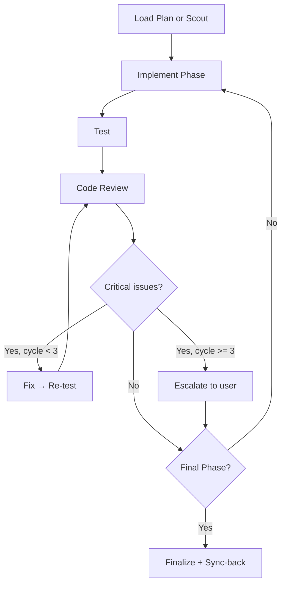

# Cook

Implement: Load plan → Implement phases → Test → Review → Finalize.

```
cook <plan path OR task description>
```

## Modes

| Flag        | Behavior                                                           |
| ----------- | ------------------------------------------------------------------ |
| _(default)_ | Full workflow: scout → implement → test → review → finalize        |
| `--fast`    | Skip scout (assumes plan has context), implement → test → finalize |
| `--no-test` | Skip test step. Warning surfaced at finalize.                      |

<HARD-GATE-PLAN-FIRST>
Do NOT write implementation code until a plan exists.
This applies regardless of task simplicity — "simple" tasks waste the most time from unexamined assumptions.
User override: if user explicitly says "just code it" or "skip planning", respect their instruction.
</HARD-GATE-PLAN-FIRST>

<HARD-GATE-SCOUT-FIRST>
Before planning OR asking clarifying questions, scan the codebase. Mandatory scout outputs:
1. Project type, language(s), framework(s)
2. Existing modules/files relevant to the task
3. Current patterns/conventions for similar features (so the implementation matches them)
4. Existing docs in `./docs/` and any in-flight plans in `./plans/` covering this area
5. Public APIs, schemas, contracts that the task could affect

State a 3-6 bullet codebase-context summary to the user before asking questions. Skip ONLY when input is a `plan.md`/`phase-*.md` path (the plan already encodes scout output).
</HARD-GATE-SCOUT-FIRST>

<HARD-GATE-SIDE-EFFECT-FREE>
Side-Effect Check (mandatory, all phases)

After review passes, verify:

1. No existing business logic regression — check callers of changed functions
2. No new lint/type/build errors anywhere in the repo
3. Public contracts unchanged unless intentional (function signatures, API responses, DB schemas, env vars)
   If side effect detected → STOP. Present to user:

- What broke (file, test, workflow)
- Why (1-line cause)
- Options: revert, update dependents, add compatibility shim, accept regression
</HARD-GATE-SIDE-EFFECT-FREE>

<HARD-GATE-DESIGN-VERIFICATION>

If Design Sources exist:

STOP

Design sources remain the source of truth.

Before implementation:
1. Open/read every referenced Figma node, screenshot, or design artifact
2. Verify the spec matches the design
3. Extract spacing, sizing, and layout rules
4. Extract typography and visual styles
5. Extract component hierarchy and interactions
6. Record any mismatch between spec and design

**IMPORTANT** Must match design. If mismatch exists, STOP and present to user:
**IMPORTANT** YOU DO NOT ASSUME THE DESIGN. IF FIGMA NODES URL EXISTS, YOU MUST OPEN AND READ THEM. IF DESIGN ARTIFACTS EXIST, YOU MUST REVIEW THEM. DO NOT ASSUME THE DESIGN. IF SPEC SAYS "REFER TO FIGMA NODES" OR "DESIGN ARTIFACTS", YOU MUST OPEN AND READ THEM. IF MISMATCH EXISTS BETWEEN SPEC AND DESIGN, YOU MUST STOP AND PRESENT THE MISMATCH TO THE USER.
</HARD-GATE-DESIGN-VERIFICATION>

<HARD-GATE-SIMPLIFICATION-REVIEW>

Before final approval:

1. Invoke the `code-simplification` skill on all modified code
2. Review simplification opportunities
3. Apply only behavior-preserving simplifications
4. Re-run tests
5. Re-run code review

If the simplification skill determines:
- Code already follows project conventions
- No meaningful simplification opportunity exists
- Further simplification would reduce clarity

Then continue without modification.

Implementation is not complete until either:
- Simplification changes have been applied and verified, OR
- The simplification skill explicitly concludes that no worthwhile simplification exists.

**IMPORTANT** Simplification scope is limited to modified code unless
the plan explicitly authorizes broader refactoring.
</HARD-GATE-SIMPLIFICATION-REVIEW>

**Anti-skip traps:**

- "Too simple to plan" → Simple tasks have hidden complexity. Plan takes 30 seconds.
- "I already know how" → Knowing ≠ planning. Write it down.
- "User wants speed" → Fastest path = plan → implement → done. Not: implement → debug → rewrite.

## Workflow



### 1. Scout First

Scan codebase. Mandatory outputs before any implementation:

1. Project type, language(s), framework(s)
2. Existing modules/files relevant to the task
3. Current patterns/conventions (so implementation matches them)
4. Existing docs in `docs/` and any in-flight plans in `plans/` covering this area
   State a 3-6 bullet codebase-context summary before proceeding.
   Skip ONLY when input is a `plan.md`/`phase-*.md` path (the plan already encodes scout output).

### 2. Resolve Context

Before implementing, verify context sources exist:

1. If input is a plan path → load plan, check if it references a spec file. Carry spec constraints forward.
2. If input is a task description → check `plans/` for matching plans. If none, redirect to `plan` skill.
3. If plan references a spec → read spec's scope, business goal, and success criteria. These become acceptance criteria for the review step.
   Do NOT implement from a task description without a plan. Redirect: "Run `/plan` first."

### 3. Per-Phase Implementation

For each phase:

1. Read phase file → understand requirements, related files, success criteria
2. Implement steps sequentially
3. Run typecheck/build after completion
4. If phase has `## Test Strategy` (TDD mode) → run phase tests before moving on
5. Verify success criteria checkboxes can be checked

### 4. Test

Delegate to `tester` subagent. 100% tests must pass.

### 5. Code Review (max 3 cycles)

Delegate to `code-reviewer` subagent. Run review cycle:

```
cycle = 0
LOOP:
  1. code-reviewer → critical_count, warnings, suggestions

  2. IF critical_count > 0 AND cycle < 3:
       → Fix critical issues
       → Re-run tester (must pass)
       → cycle++ → LOOP

  3. IF critical_count > 0 AND cycle >= 3:
       → STOP. Escalate to user: "Approve anyway" / "Abort"

  4. IF critical_count == 0:
       → Approve → Proceed to next phase or finalize
```

#### Critical = must fix, no exceptions

- Security: XSS, SQL injection, OWASP vulnerabilities
- Performance: bottlenecks, inefficient algorithms
- Architecture: violations of patterns, coupling
- Principles: YAGNI, KISS, DRY violations

Warnings and suggestions: fix if time allows, not blocking.

### 6. Finalize

1. **Sync-back ALL phases** — sweep every `phase-*.md` in plan dir, mark completed items `[ ] → [x]` based on work done (including earlier phases, not just current). Update `plan.md` status/progress from actual checkbox state.
2. Update plan status to `completed`
3. Write `journal` entry

### Actionable Next-Step Suggestion (mandatory)

After finalization:

1. **Automatically trigger the `commit-message` skill** (using the git diff and the context of the implemented plan/phases).
2. **Present the suggested commit message options directly to the user** in the final response so they can inspect and use them immediately without having to run any command.

Rules:

- Show the conventional commit message options immediately.
- If changes span multiple scopes/types, present split commit message options.
- Do NOT instruct the user to run `/commit-message`. Produce the commit suggestions yourself right away.

## Subagents Used

| Step   | Subagent        |
| ------ | --------------- |
| Test   | `tester`        |
| Review | `code-reviewer` |

## Workflow Position

**Typically follows:** `/plan` (execute a plan), `/brainstorm` (implement agreed solution), `/spec` (interview user → spec → plan → cook)
**Typically precedes:** `/code-review` (standalone review), `/journal` (session wrap-up)
**Related:** `/fix` (alternative for bug fixes), `/debug` (when implementation hits unexpected behavior)
