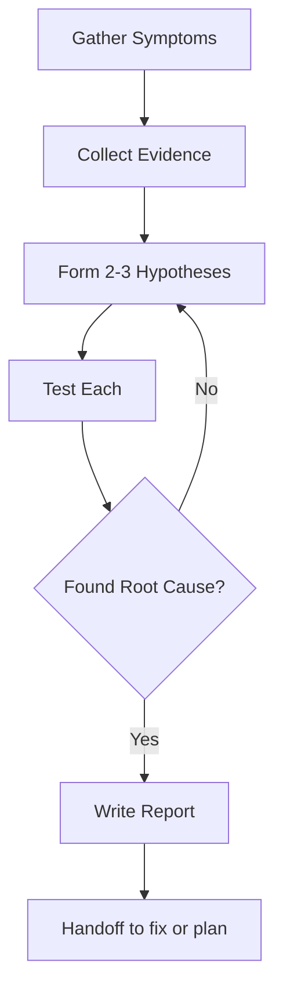

# Debug

Systematic RCA: Collect evidence → Hypotheses → Test → Root cause → Report.

## Workflow

## Step 1: Gather Symptoms
- Exact error messages, stack traces, timestamps
- What changed recently? (deploys, config, deps)
- Affected components + reproduction steps

## Step 2: Collect Evidence
- Read relevant code paths, logs, error outputs
- Check CI/CD history (`gh run list`), recent commits
- Query DB if applicable (`psql`)
- Use grep to trace execution paths

## Step 3: Form & Test Hypotheses
- Generate 2-3 competing explanations
- Test each systematically: confirm or eliminate
- Do not lock onto first explanation
- Build timeline correlating events

## Step 4: Root Cause
- State cause with evidence chain, not speculation
- Distinguish immediate cause from underlying cause
- Note environmental factors (race conditions, timing, data state)

## Step 5: Report & Handoff
Write concise report:
- Executive summary (issue, root cause, recommended fix)
- Timeline + evidence
- Fix options (complexity estimate for each)
- Preventive measures

Then offer:
| Option | When |
|--------|------|
| `fix <report path>` (Recommended) | Root cause clear, fix plan obvious |
| `brainstorm` | Multiple fix options, need design input |
| End | User handles fix |

## Subagent Usage
| Agent | When |
|---|---|
| `researcher` | Need to investigate external library behavior |
| No code changes — only investigate and report |
