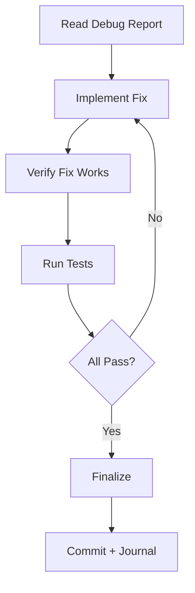

# Fix

Apply fix: Read report → Implement → Verify → Test → Finalize.

## Workflow

## Step 1: Understand the Fix
- Read debug report (root cause, recommended fix)
- Read affected files to confirm understanding
- If fix approach is unclear → call `brainstorm`

## Step 2: Implement
- Apply minimal changes — only what's needed to fix
- Add error handling for the discovered edge case
- Add tests that reproduce the bug (prevent regression)

## Step 3: Verify
- Manually test: does the bug still reproduce?
- Run typecheck/lint
- Run `tester` subagent for full test suite

## Step 4: Finalize
- Write `journal` entry
- Offer commit via `git` skill

## Principles
- Fix the root cause, not the symptom
- If fix touches >3 files or logic is complex → run `code-review` first
- Always add a regression test

## Subagent Usage
| Agent | When |
|---|---|
| `tester` | Always — run suite after fix |
| `code-reviewer` | Fix is non-trivial (>3 files or complex logic) |
