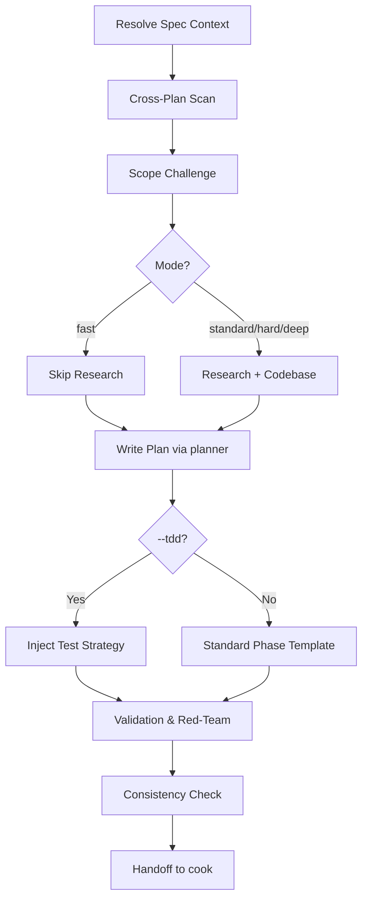

# Plan

Lightweight planning workflow: Resolve Spec Context → Cross-Plan Scan → Scope Challenge → Workflow Mode Selection (Fast, Standard, Hard, Deep) [with optional TDD] → Research → Write Plan → Validation & Inline Red-Team → Consistency Check → Handoff.

## Language

**Important** Write the plan in english

## How It Works



## Step 0: Resolve Spec Context

Before scope challenge, check whether an approved spec file already exists.

Treat spec as an approved requirement artifact first, not just a loose context dump.
The planner should assume the spec file already reflects a reviewed spec with scope, business intent, workflow placement, and open assumptions.

### Resolution Order

1. If the user passed a spec file path explicitly, use it.
2. Otherwise auto-match `docs/*/*-spec.md` by task slug / filename slug.
3. If exactly one spec file matches, load it and read its YAML frontmatter first.
4. If multiple spec files plausibly match, stop and ask the user which one to use.
5. If none match, continue but explicitly note that plan was created without saved spec context.

If the user only has an approved spec in chat and no saved spec file yet, prefer asking them to save or run `spec` first.
Only continue without a saved spec file when the user explicitly wants to proceed, and record the risk in the plan.

### Required imports from spec file

If a spec file is found, the planner MUST extract and carry forward:

- spec file path
- request summary
- business goal
- before/after state
- workflow placement
- scope in/out summary
- assumptions / unresolved questions
- related FE specs
- Figma URL(s) and node ID(s), if present

### Handoff rule

If the spec contains a Figma URL, `plan.md` MUST repeat it and every FE/UI-related phase file MUST repeat the relevant Figma URL and node IDs in its context section. Do not force Figma into BE-only phases.

## Step 0.5: Cross-Plan Scan

Before creating a plan, perform a scan of existing plans in `plans/*/plan.md` to prevent conflicts and identify dependencies:

1. Scan all unfinished plans (where status is not `completed` or `cancelled`).
2. Identify overlapping files in the `Related Code Files` sections.
3. Check for shared modules or adjacent database tables.
4. If overlaps or potential conflicts are found:
   - Present a clear warning to the user.
   - Propose linking the plans (e.g., stating which plan blocks or depends on which).

## Step 1: Scope Challenge & Mode Selection

Before any planning, ask:

1. **What already exists?** — Scan codebase for reusable code/patterns.
2. **What's the minimum change set?** — Defer everything non-blocking.
3. **Complexity check** — >8 files or >3 phases? Can we merge/reduce?

### Workflow Modes

Select the planning depth based on task complexity or explicit flags:

| Mode / Flag            | Complexity / Use Case                                                           | Research Effort                                     | Validation & Red-Team                                  |
| :--------------------- | :------------------------------------------------------------------------------ | :-------------------------------------------------- | :----------------------------------------------------- |
| `--fast`               | Trivial tasks (1 file fix, <20 words), or quick hotfixes.                       | None (Skip research).                               | Basic validation checklist. Skip Red-Team.             |
| `--standard` (default) | Moderate features, refactors, standard tasks.                                   | Standard (1 researcher subagent).                   | Validation checklist. Basic inline Red-Team questions. |
| `--hard`               | Critical features, database migrations, security changes, or high blast-radius. | High (2 researchers).                               | Full validation interview + inline Red-Team checklist. |
| `--deep`               | Complex architecture changes, integrations, or major codebase refactoring.      | Deep (2 researchers + per-phase codebase scouting). | Full validation interview + inline Red-Team checklist. |

### Composable Flags

- `--tdd`: Can be combined with any mode. Adds a mandatory `## Test Strategy` section to every phase file template.

## Step 2: Research

- Read existing docs: `docs/codebase-summary.md`, `code-standards.md`, `system-architecture.md`.
- Depending on the selected mode, research as follows:
  - **Fast mode**: Skip research entirely.
  - **Standard mode**: Spawn 1 `researcher` subagent via `Task` for unfamiliar areas.
  - **Hard/Deep modes**: Spawn 2 `researcher` subagents to explore alternative patterns or edge cases. For **Deep mode**, also perform targeted grep searches for each planned phase's target files beforehand.

## Step 3: Codebase Understanding

- Use grep/glob to find relevant files, existing patterns, API endpoints.
- Check imports in neighboring files to understand conventions.
- Identify files to create/modify/delete.

## Step 4: Write Plan (planner subagent)

Delegate to `planner` subagent with:

- Research findings (if any)
- File inventory (create/modify/delete)
- Key constraints and architectural decisions
- Spec file path and extracted context, when available

The planner writes `plan.md` + `phase-*.md` files into `plans/{YYYYMMDD-HHMM}-{slug}/`.

### `plan.md` required sections

Every `plan.md` MUST preserve the repo's plan metadata block near the top, including status tracking and cross-plan dependency fields when they exist.

Every `plan.md` MUST include a `## Context Inputs` section near the top.

When spec exists, include:

- `Spec file: docs/YYYY-MM-DD-HHMM/...-spec.md`
- `Figma URL: ...` when available
- `Figma node IDs: ...` when available
- `Related FE spec: ...` when available

Every `plan.md` MUST also include a short `## Context Summary` section that carries forward the spec scope, notable assumptions, and design constraints needed by a fresh-session implementer.

When spec exists, `## Context Summary` should also restate the business goal, workflow placement, and intended before/after state so implementation does not drift into the wrong solution.

Include a `## Validation Log` section for recording responses to validation and Red-Team checklists.

## Phase Decomposition Rules

Each phase must satisfy ALL of:

- **Single focus** — one logical concern per phase (FE/BE/infra/test/docs are separate)
- **Max effort** — estimated execution ≤ 1 day for a fullstack-developer
- **Max files** — touches ≤ 20 files (else split into more phases)
- **Parallel-safe** — no two phases can touch the same file (file ownership)
- **Independent** — each phase produces shippable value; no phase exists only to "enable" another
If a phase violates any → split it.

Instead of building all the database, then all the API, then all the UI — build one complete feature path at a time:

**Bad (horizontal slicing):**
```
phase 1: Build entire database schema
phase 2: Build all API endpoints
phase 3: Build all UI components
phase 4: Connect everything
```

**Good (vertical slicing):**
```
phase 1: User can create an account (schema + API + UI for registration)
phase 2: User can log in (auth schema + API + UI for login)
phase 3: User can create a task (task schema + API + UI for creation)
phase 4: User can view task list (query + API + UI for list view)
```

**Phase file template:**

```markdown
---
phase: <N>
title: "<Phase Name>"
status: pending
priority: P2
effort: ""
dependencies: [] # List of phase numbers this phase depends on, e.g. [phase-01] or [phase-01, phase-02]
---

# Phase <N>: <Name>

## Context Links

- Spec: `docs/specs/YYYY-MM-DD-HHMM/...-spec.md` or `N/A`
- Figma: `https://www.figma.com/design/...` or `N/A`
- Node IDs: `12345:67890` or `N/A`
- Related spec: `docs/...` or `N/A`

## Overview

<1-2 sentences>

## Requirements

- Functional: ...
- Non-functional: ...

## Architecture

<Design, data flow, component interactions>

## Related Code Files

- Create: `path/to/file`
- Modify: `path/to/file`
- Delete: `path/to/file`

## Test Strategy (Active only if --tdd is set)

- Unit tests to write: ...
- Integration / E2E tests: ...
- Manual verification steps: ...

## Implementation Steps

1. ...
2. ...

## Success Criteria

- [ ] ...

## Risk Assessment

<Risks + mitigations>
```

Rules:

- FE/UI/layout/browser-verification phases MUST include spec path plus Figma URL/node IDs when the spec contains them
- Backend-only / infra-only phases may keep `Figma: N/A` if design is not relevant to that phase
- Use repo-relative paths, not prose like "see prep"

**Plan directory structure:**

```
plans/{YYYYMMDD-HHMM}-{slug}/
├── plan.md
├── phase-01-{name}.md
├── phase-02-{name}.md
└── ...
```

## Step 5: Validation & Red-Team Checklist

After the plan is written, review it systematically. Record answers and findings under `## Validation Log` in `plan.md`.

### 1. Standard Validation Checklist

Ask and answer the following:

1. **Dependencies**: Do any phases have dependencies? Does one phase block another?
2. **Scope Drift**: Has the scope drifted? Were any unnecessary features or "nice-to-have" code elements added?
3. **Paths**: Are all file paths in the plan correct and verified in the codebase?
4. **Measurability**: Are the success criteria measurable? ("done" must be observable, not vague).
5. **Assumptions**: Are there any unverified assumptions remaining?

### 2. Inline Red-Team Checklist (Adversarial Assessment)

For all non-fast modes, ask the following hostile/adversarial questions:

1. **Blast Radius & Failure Mode**: What is the worst-case failure mode of this change, and what is its blast radius? How is it contained?
2. **Fragility**: Which assumptions in this design/architecture are most fragile or likely to change?
3. **Rollback**: If this fails in production (e.g., database lock, migration error, broken layout), what is the rollback plan?
4. **Security Vectors**: What security vectors are exposed (auth, input validation, CSRF, rate-limiting, permissions, data exposure)?
5. **Performance & Bottlenecks**: Are there performance bottlenecks introduced (N+1 queries, heavy table locks, larger JS bundle size)?

Use `AskUserQuestion` when clarification is needed.

## Step 6: Consistency Check

After any plan file edits: **re-read all files** (`plan.md` + all `phase-*.md`).

Search for:

- Old names or assumptions that were rejected
- Files/APIs/fields renamed in one phase but not updated in others
- Implementation steps that contradict each other
- Spec/Figma links present in `plan.md` but missing from FE/UI phases
- FE/UI phases that require design fidelity but omit Figma URL/node IDs even though the spec had them

If any contradictions remain → alert the user. Do not recommend cook until resolved.

## Step 7: Post-Plan Handoff

Recommend the next step based on the risk, scope, and complexity of the plan:

| Scenario / Risk                | Recommended Next Step                                        | Reason                                                            |
| :----------------------------- | :----------------------------------------------------------- | :---------------------------------------------------------------- |
| **Small plan, low-risk**       | `cook plans/{YYYYMMDD-HHMM}-{slug}/plan.md`                  | Skip extra reviews; proceed directly to execution.                |
| **Complex plan, high-risk**    | Request user review/approval of the plan first, then `cook`. | High impact requires developer validation before generating code. |
| **User wants to pause / exit** | Return the complete plan path.                               | Save plan context for the next session.                           |

### Actionable Next-Step Suggestion (mandatory)

After the plan is finalized, always present the next step in this exact format:

```
✅ Plan created: plans/{YYYYMMDD-HHMM}-{slug}/plan.md
   Phases: N phase(s)

👉 Next step — implement the plan:
/cook plans/{YYYYMMDD-HHMM}-{slug}/plan.md
```

For high-risk plans, present it as:

```
✅ Plan created: plans/{YYYYMMDD-HHMM}-{slug}/plan.md
   Phases: N phase(s)
   ⚠️ High-risk — please review the plan before proceeding.

👉 After review, implement with:
/cook plans/{YYYYMMDD-HHMM}-{slug}/plan.md
```

Rules:

- Use the **actual plan directory path**, not a placeholder
- Always include phase count for quick context
- Do NOT say "you can now run cook" without providing the full command

## Subcommand: Archive

To archive a plan (e.g., when requested as `/plan archive` or to archive completed work):

1. Locate the target plan folder in `plans/`.
2. Ensure the destination directory `plans/.archive/` exists.
3. Move the plan directory there: `mv plans/{plan-folder} plans/.archive/`.
4. Create/update a `lessons-learned.md` log inside `plans/.archive/` summarizing what went well, what failed, and key architectural insights from the implementation.

## Subagent Usage

| Agent                                             | When                                                                                                |
| ------------------------------------------------- | --------------------------------------------------------------------------------------------------- |
| `planner`                                         | Always — to write plan files                                                                        |
| `researcher`                                      | When the task uses an unfamiliar tech stack or the solution is unclear (depending on Workflow Mode) |
| Do not use red-team or code-reviewer for planning |
