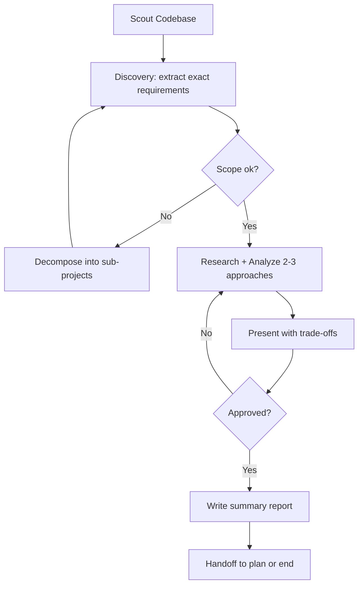

# Brainstorm

Systematic solution exploration: Scout → Discover → Analyze → Decide → Handoff.

## Workflow

## Step 1: Scout Phase (MANDATORY)
Before any question or approach:
- Read `README.md`, relevant `docs/*.md`, in-flight `plans/`
- Identify: project type, language, framework, existing patterns
- Note modules the request will touch

Output 3-6 bullet summary to user before asking anything.

## Step 2: Discovery Phase
Extract exact requirements via `question` tool. Must get concrete answers for:
1. **Expected output** — what artifact at the end? (file, screen, API shape, CLI command)
2. **Acceptance criteria** — how to verify it's done right
3. **Scope boundary** — what is OUT explicitly
4. **Non-negotiable constraints** — stack, paths, naming, deadlines
5. **Touchpoints** — which existing files/modules will change

If any is vague → ask again. No hand-wavy answers.

## Step 3: Research & Analysis
- For unfamiliar tech: spawn 1 `researcher` subagent
- Evaluate 2-3 approaches with honest trade-offs (complexity, cost, maintainability)
- Challenge assumptions — simplest viable option wins

## Step 4: Document
Write a summary report with:
- Problem + requirements
- Approaches evaluated (pros/cons)
- Chosen solution + rationale
- Risks + mitigations
- Next steps

## Step 5: Handoff
When user confirms and no questions remain — offer:

| Option | When |
|--------|------|
| `plan` (Recommended) | Standard new feature |
| `plan --fast` | Simple, well-understood change |
| End | User wants to stop |

Pass report path as context. Then run `journal`.

## Subagent Usage
| Agent | When |
|---|---|
| `researcher` | Unfamiliar tech stack or unclear solution |
| No implementation, no prototyping, no code |
