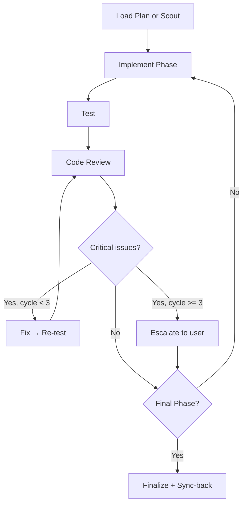

# Cook

Implement: Load plan → Implement phases → Test → Review → Finalize.

```
cook <plan path OR task description>
```

**HARD GATE:** Do NOT write implementation code until a plan exists.
This applies regardless of task simplicity — "simple" tasks waste the most time from unexamined assumptions.
User override: if user explicitly says "just code it" or "skip planning", respect their instruction.

## Workflow



### 1. Scout First

Scan codebase for project type, existing patterns, relevant files.

### 2. Per-Phase Implementation

- Read phase file → implement steps sequentially
- Run typecheck/build after each phase

### 3. Test

Delegate to `tester` subagent. 100% tests must pass.

### 4. Code Review (max 3 cycles)

Delegate to `code-reviewer` subagent. Run review cycle:

```
cycle = 0
LOOP:
  1. code-reviewer → critical_count, warnings, suggestions

  2. IF critical_count > 0 AND cycle < 3:
       → Fix critical issues
       → Re-run tester (must pass)
       → cycle++ → LOOP

  3. IF critical_count > 0 AND cycle >= 3:
       → STOP. Escalate to user: "Approve anyway" / "Abort"

  4. IF critical_count == 0:
       → Approve → Proceed to next phase or finalize
```

#### Critical = must fix, no exceptions

- Security: XSS, SQL injection, OWASP vulnerabilities
- Performance: bottlenecks, inefficient algorithms
- Architecture: violations of patterns, coupling
- Principles: YAGNI, KISS, DRY violations

Warnings and suggestions: fix if time allows, not blocking.

### 5. Finalize

1. **Sync-back ALL phases** — sweep every `phase-*.md` in plan dir, mark completed items `[ ] → [x]` based on work done (including earlier phases, not just current). Update `plan.md` status/progress from actual checkbox state.
2. Update plan status to `completed`
3. Offer commit via `git` skill
4. Write `journal` entry

## Subagents Used

| Step   | Subagent        |
| ------ | --------------- |
| Test   | `tester`        |
| Review | `code-reviewer` |

## Workflow Position

**Typically follows:** `/plan` (execute a plan), `/brainstorm` (implement agreed solution), `/specs` (interview user until can make a plan)
**Typically precedes:** `/code-review` (review after implementation)