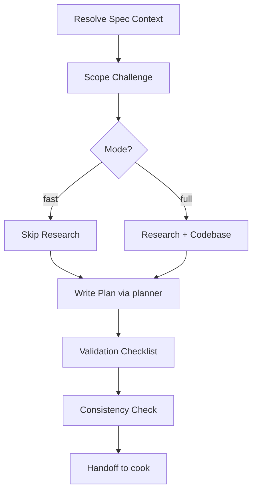

# Plan

Lightweight planning workflow: Resolve Spec Context → Scope Challenge → Research → Write Plan → Validate.

## How It Works



## Step 0: Resolve Spec Context

Before scope challenge, check whether an approved spec file already exists.

Treat spec as an approved requirement artifact first, not just a loose context dump.
The planner should assume the spec file already reflects a reviewed spec with scope, business intent, workflow placement, and open assumptions.

### Resolution Order

1. If the user passed a spec file path explicitly, use it.
2. Otherwise auto-match `docs/*/*-spec.md` by task slug / filename slug.
3. If exactly one spec file matches, load it and read its YAML frontmatter first.
4. If multiple spec files plausibly match, stop and ask the user which one to use.
5. If none match, continue but explicitly note that plan was created without saved spec context.

If the user only has an approved spec in chat and no saved spec file yet, prefer asking them to save or run `spec` first.
Only continue without a saved spec file when the user explicitly wants to proceed, and record the risk in the plan.

### Required imports from spec file

If a spec file is found, the planner MUST extract and carry forward:
- spec file path
- request summary
- business goal
- before/after state
- workflow placement
- scope in/out summary
- assumptions / unresolved questions
- related FE specs
- Figma URL(s) and node ID(s), if present

### Handoff rule

If the spec contains a Figma URL, `plan.md` MUST repeat it and every FE/UI-related phase file MUST repeat the relevant Figma URL and node IDs in its context section. Do not force Figma into BE-only phases.

## Step 1: Scope Challenge (3 questions)

Before any planning, ask:

1. **What already exists?** — Scan codebase for reusable code/patterns
2. **What's the minimum change set?** — Defer everything non-blocking
3. **Complexity check** — >8 files or >3 phases? Can we merge/reduce?

Then decide: **fast** (skip research, straight to plan) or **full** (do research first).

- `--fast` flag → skip research, but DO NOT skip spec-context resolution when a saved spec exists
- If task is trivial (1 file fix, <20 words) → auto-fast

## Step 2: Research (full mode only)

- Read existing docs: `docs/codebase-summary.md`, `code-standards.md`, `system-architecture.md`
- For unfamiliar areas: spawn 1 `researcher` subagent via Task tool
- No parallel researchers, no docs-seeker, no sequential-thinking — keep it lean

## Step 3: Codebase Understanding

- Use grep/glob to find relevant files, existing patterns, API endpoints
- Check imports in neighboring files to understand conventions
- Identify files to create/modify/delete

## Step 4: Write Plan (planner subagent)

Delegate to `planner` subagent with:
- Research findings (if any)
- File inventory (create/modify/delete)
- Key constraints and architectural decisions
- Spec file path and extracted context, when available

The planner writes `plan.md` + `phase-*.md` files into `plans/{YYYYMMDD-HHMM}-{slug}/`.

### `plan.md` required sections

Every `plan.md` MUST preserve the repo's plan metadata block near the top, including status tracking and cross-plan dependency fields when they exist.

Every `plan.md` MUST include a `## Context Inputs` section near the top.

When spec exists, include:
- `Spec file: docs/YYYY-MM-DD-HHMM/...-spec.md`
- `Figma URL: ...` when available
- `Figma node IDs: ...` when available
- `Related FE spec: ...` when available

Every `plan.md` MUST also include a short `## Context Summary` section that carries forward the spec scope, notable assumptions, and design constraints needed by a fresh-session implementer.

When spec exists, `## Context Summary` should also restate the business goal, workflow placement, and intended before/after state so implementation does not drift into the wrong solution.

## Phase Decomposition Rules

Each phase must satisfy ALL of:
- **Single focus** — one logical concern per phase (FE/BE/infra/test/docs are separate)
- **Max effort** — estimated execution ≤ 1 day for a fullstack-developer
- **Max files** — touches ≤ 20 files (else split into more phases)
- **Parallel-safe** — no two phases can touch the same file (file ownership)
- **Independent** — each phase produces shippable value; no phase exists only to "enable" another

If a phase violates any → split it.

**Phase file template:**

```markdown
---
phase: <N>
title: "<Phase Name>"
status: pending
priority: P2
effort: ""
---

# Phase <N>: <Name>

## Context Links
- Spec: `docs/specs/YYYY-MM-DD-HHMM/...-spec.md` or `N/A`
- Figma: `https://www.figma.com/design/...` or `N/A`
- Node IDs: `12345:67890` or `N/A`
- Related spec: `docs/...` or `N/A`

## Overview
<1-2 sentences>

## Requirements
- Functional: ...
- Non-functional: ...

## Architecture
<Design, data flow, component interactions>

## Related Code Files
- Create: `path/to/file`
- Modify: `path/to/file`
- Delete: `path/to/file`

## Implementation Steps
1. ...
2. ...

## Success Criteria
- [ ] ...

## Risk Assessment
<Risks + mitigations>
```

Rules:
- FE/UI/layout/browser-verification phases MUST include spec path plus Figma URL/node IDs when the spec contains them
- Backend-only / infra-only phases may keep `Figma: N/A` if design is not relevant to that phase
- Use repo-relative paths, not prose like "see prep"

**Plan directory structure:**
```
plans/{YYYYMMDD-HHMM}-{slug}/
├── plan.md
├── phase-01-{name}.md
├── phase-02-{name}.md
└── ...
```

## Step 5: Validation Checklist

After plan is written, run through these questions:

1. "Do any phases have dependencies? Does one phase block another?"
2. "Has the scope drifted? Were any unnecessary features added?"
3. "Are all file paths in the plan correct?"
4. "Are the success criteria measurable? ('done' must be observable, not vague)"
5. "Are there any unverified assumptions?"

Use the repo's available user-question tool when needed. In this environment, use `question`. Record answers in `## Validation Log` in `plan.md`.

## Step 6: Consistency Check

After any plan file edits: **re-read all files** (`plan.md` + all `phase-*.md`).

Search for:
- Old names or assumptions that were rejected
- Files/APIs/fields renamed in one phase but not updated in others
- Implementation steps that contradict each other
- Spec/Figma links present in `plan.md` but missing from FE/UI phases
- FE/UI phases that require design fidelity but omit Figma URL/node IDs even though the spec had them

If any contradictions remain → alert the user. Do not recommend cook until resolved.

## Step 7: Post-Plan Handoff

After the plan is complete, recommend the next step:

| Scenario | Recommend |
|---|---|
| Small plan, low-risk | `cook {path}/plan.md` |
| Complex plan, needs review | `cook {path}/plan.md` (user reviews first) |
| User wants to stop | Return plan path |

## Subagent Usage

| Agent | When |
|-------|------|
| `planner` | Always — to write plan files |
| `researcher` | When the task uses an unfamiliar tech stack or the solution is unclear |
| Do not use red-team or code-reviewer for planning |
