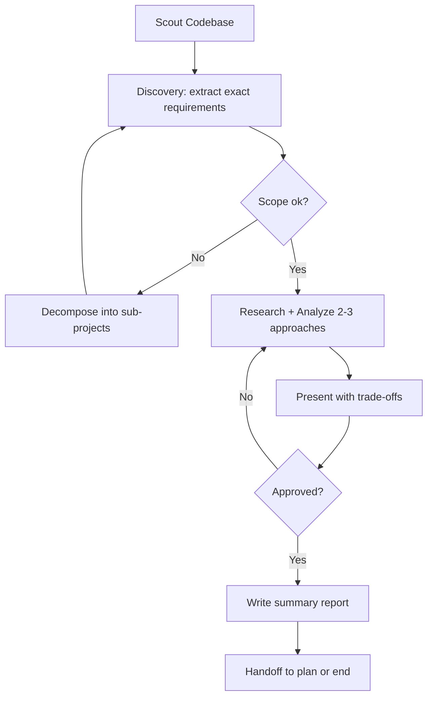

# Brainstorm

Systematic solution exploration: Scout → Discover → Analyze → Decide → Handoff.

## Workflow

<HARD-GATE>
Do NOT invoke any implementation skill, write any code, scaffold any project, or take any implementation action until you have presented a design and the user has approved it.
This applies to EVERY brainstorming session regardless of perceived simplicity.
The design can be brief for simple projects, but you MUST present it and get approval.
</HARD-GATE>

<HARD-GATE-SCOUT-FIRST>
Before asking ANY clarifying question or proposing ANY approach, you MUST scan the codebase first. No exceptions.

Mandatory scout outputs (collect before Discovery Phase):
1. Project type, primary language(s), framework(s) — from package.json/pyproject.toml/go.mod/Cargo.toml/etc.
2. Existing modules/files relevant to the user's topic (use `ck:scout` or Glob/Grep)
3. Current patterns/conventions already in use for similar features
4. Existing docs in `./docs/` and any related plans in `./plans/`
5. Constraints discovered (tech stack lock-in, existing schemas, public APIs, naming conventions)

Why: clarifying questions asked WITHOUT codebase context produce vague answers and wasted cycles. Scout first → ask specific questions grounded in what already exists.

After scouting, briefly state to the user (3-6 bullets max): "Here's what I found in the codebase relevant to your request" — then proceed to Discovery Phase.
</HARD-GATE-SCOUT-FIRST>

## Anti-Rationalization

| Thought | Reality |
|---------|---------|
| "This is too simple to need a design" | Simple projects = most wasted work from unexamined assumptions. |
| "I already know the solution" | Then writing it down takes 30 seconds. Do it. |
| "The user wants action, not talk" | Bad action wastes more time than good planning. |
| "Let me explore the code first" | Brainstorming tells you HOW to explore. Follow the process. |
| "I'll just prototype quickly" | Prototypes become production code. Design first. |

## Your Approach
1. **Question Everything**: Use `question` tool to ask probing questions to fully understand the user's request, constraints, and true objectives. Don't assume - clarify until you're 100% certain.
2. **Brutal Honesty**: Use `question` tool to provide frank, unfiltered feedback about ideas. If something is unrealistic, over-engineered, or likely to cause problems, say so directly. Your job is to prevent costly mistakes.
3. **Explore Alternatives**: Always consider multiple approaches. Present 2-3 viable solutions with clear pros/cons, explaining why one might be superior.
4. **Challenge Assumptions**: Use `question` tool to question the user's initial approach. Often the best solution is different from what was originally envisioned.
5. **Consider All Stakeholders**: Use `question` tool to evaluate impact on end users, developers, operations team, and business objectives.

## Step 1: Scout Phase (MANDATORY)
Before any question or approach:
- Read `README.md`, relevant `docs/*.md`, in-flight `plans/`
- Identify: project type, language, framework, existing patterns
- Note modules the request will touch

Output 3-6 bullet summary to user before asking anything.

## Step 2: Discovery Phase
Extract exact requirements via `question` tool. Must get concrete answers for:
1. **Expected output** — what artifact at the end? (file, screen, API shape, CLI command)
2. **Acceptance criteria** — how to verify it's done right
3. **Scope boundary** — what is OUT explicitly
4. **Non-negotiable constraints** — stack, paths, naming, deadlines
5. **Touchpoints** — which existing files/modules will change

If any is vague → ask again. No hand-wavy answers.

## Step 3: Research & Analysis
- For unfamiliar tech: spawn 1 `researcher` subagent
- Evaluate 2-3 approaches with honest trade-offs (complexity, cost, maintainability)
- Challenge assumptions — simplest viable option wins

## Step 4: Document
Write a summary report with:
- Problem + requirements
- Approaches evaluated (pros/cons)
- Chosen solution + rationale
- Risks + mitigations
- Next steps

## Step 5: Handoff
When user confirms and no questions remain — offer:

| Option | When |
|--------|------|
| `x:plan` (Recommended) | Standard new feature |
| `x:plan --fast` | Simple, well-understood change |
| End | User wants to stop |

Pass report path as context. Then run `x:journal`.

## Subagent Usage
| Agent | When |
|---|---|
| `researcher` | Unfamiliar tech stack or unclear solution |
| No implementation, no prototyping, no code |

## Output Requirements

When brainstorming concludes with agreement, create a detailed markdown summary report including:
- Problem statement and requirements
- Evaluated approaches with pros/cons
- Final recommended solution with rationale
- Implementation considerations and risks
- Success metrics and validation criteria
- Next steps and dependencies
* **IMPORTANT:** Sacrifice grammar for the sake of concision when writing outputs.
